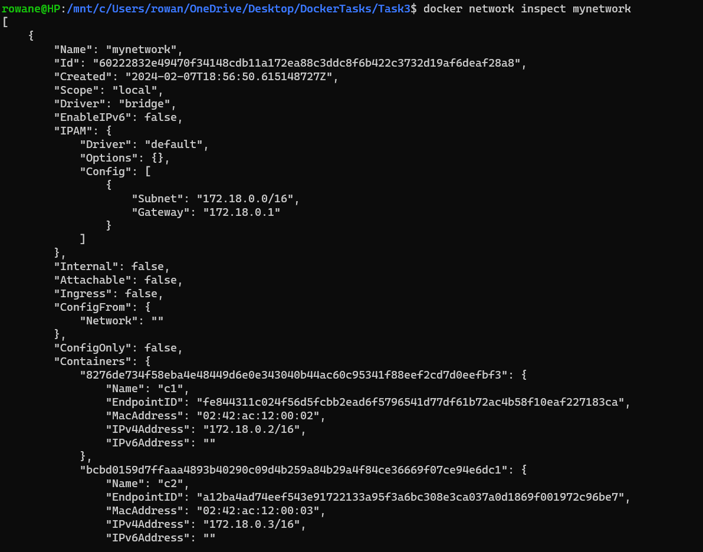
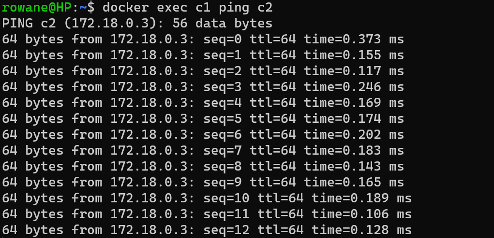
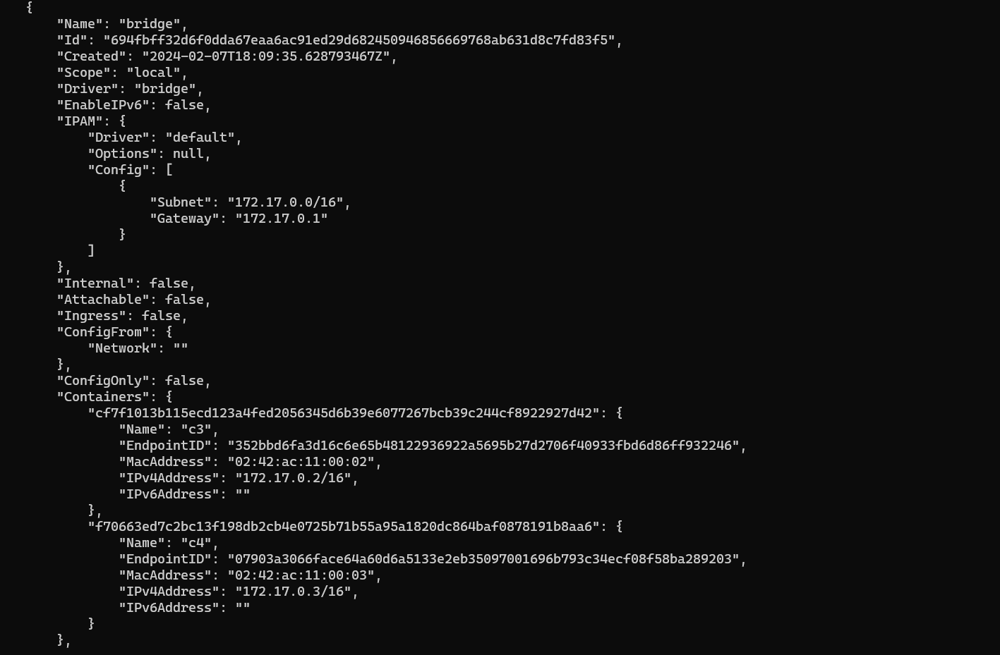
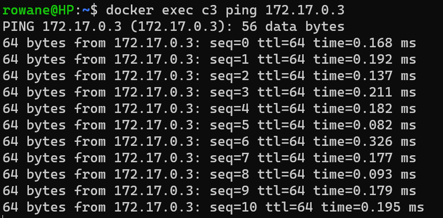
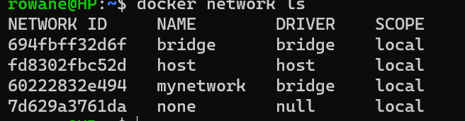

# Question 1

```Docker
docker run -it --network=host --memory=500M --name db1 --env POSTGRES_PASSWORD=pass1234 -v myVolume:/var/lib/postgresql/data postgres
```

```Docker
docker run -it --network=host --memory=500M --name db1 --env POSTGRES_PASSWORD=pass1234 --mount type=volume,source=myVolume,target=/var/lib/postgresql/data postgres
```

# Question 2

```Docker
docker network create mynetwork
docker run --name c1 --network=mynetwork alpine
docker run --name c2 --network=mynetwork alpine
docker network inspect mynetwork
```



```Docker
docker exec c1 ping c2
```



```Docker
docker run -d --name c3 alpine
docker run -d --name c4 alpine
docker network inspect bridge
```

As bridge is the default no need to write it explicitly in --network in run command
Inspect bridge to get IP addresses of c3 and c4


```Docker
docker exec c3 ping 172.17.0.3
```



# Question 3



# Question 4

c1: 172.18.0.2/16
c2: 172.18.0.3/16
c3: 172.17.0.3/16
c4: 172.18.0.3/16 (c2 was stopped)
